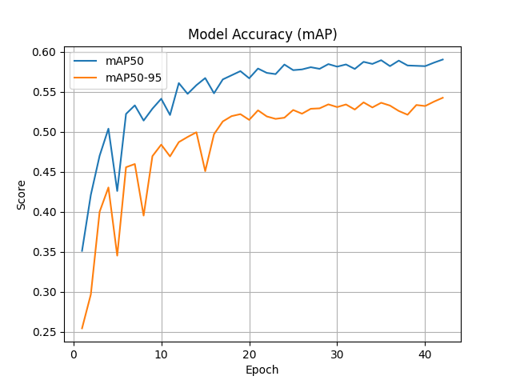
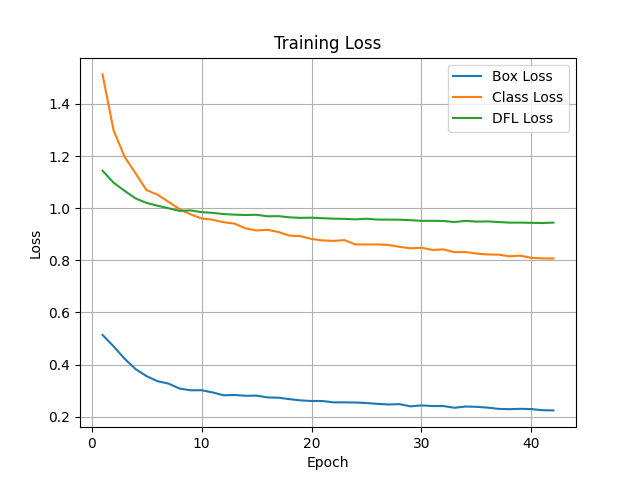
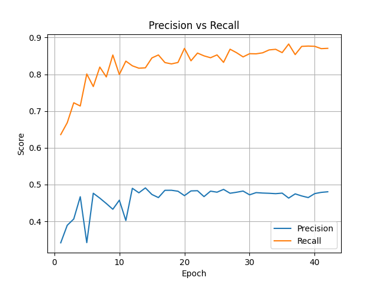

# Neuro-Oncology MRI Inference Console

MRI brain tumor detection demo built around a YOLO training run and a Gradio interface for quick qualitative testing.

Live demo: [Hugging Face Space](https://huggingface.co/spaces/edyxapi/Neuro-OncologyMRI-Inference-Console)

## Project summary

This project takes a YOLO-based object detection approach for MRI slices and wraps the trained model inside a Gradio application. The interface accepts an MRI image, runs localization with the exported `best.pt` weights, overlays the predicted box, and then calls Groq for a plain-language summary of the detected finding.

This repository is a demo and research workflow snapshot, not a clinically validated system. The current Space is meant to show the end-to-end pipeline and model behavior, and the model should be treated as lightly productionized rather than heavily optimized or extensively benchmarked.

## What was done

The training workflow came from the Kaggle notebook in [training_kaggle_notebook.ipynb](training_kaggle_notebook.ipynb). The notebook does four things:

1. copies the dataset package from Kaggle input storage into the working directory
2. rewrites `data.yaml` so Ultralytics points at the extracted local dataset path
3. installs `ultralytics`
4. trains `YOLO("yolov8m.pt")` with the configured dataset

The recorded training configuration in the notebook used:

- base model: `yolov8m.pt`
- epochs: `120`
- image size: `640`
- batch size: `16`
- optimizer: `AdamW`
- initial learning rate: `0.001`
- patience: `30`
- cache: `True`
- mixed precision: `True`

The dataset YAML defines four classes:

- `glioma`
- `meningioma`
- `notumor`
- `pituitary`

From the local dataset split used in this repo:

- train images: `12,487`
- validation images: `3,122`
- total images referenced by the current split: `15,609`

The notebook output logs show the validation run reaching approximately:

- precision: `0.48`
- recall: `0.871`
- mAP@50: `0.59`
- mAP@50:95: `0.543`

These numbers should be read as run-specific indicators from the saved notebook output, not as a final clinical benchmark.

## Repository contents

- [app.py](app.py): Gradio application and inference pipeline
- [best.pt](best.pt): exported YOLO weights used by the demo
- [training_kaggle_notebook.ipynb](training_kaggle_notebook.ipynb): Kaggle training notebook
- [graph.py](graph.py): utility script for generating training graphs from Ultralytics `results.csv`
- [plots/map.png](plots/map.png), [plots/loss.png](plots/loss.png), [plots/precision_recall.png](plots/precision_recall.png): saved training visualizations

## Training graphs

### mAP progression



### Training loss



### Precision vs recall



## Dataset and large files

The raw `dataset/` directory is intentionally not tracked in git because it is too large for normal repository history. Large artifacts and shareable packages should be distributed through the repository Releases section instead of being committed directly to source control.

If you are browsing this project from GitHub, use Releases for packaged large files when they are published there.

## Running locally

Install dependencies and run the app:

```bash
pip install -r requirements.txt
python app.py
```

Required environment variable:

- `GROQ_API_KEY`

Optional environment variable:

- `GROQ_MODEL`

## Important note

This repository and demo are for research, experimentation, and interface demonstration. They are not suitable for diagnosis, treatment planning, or any clinical decision-making workflow.
